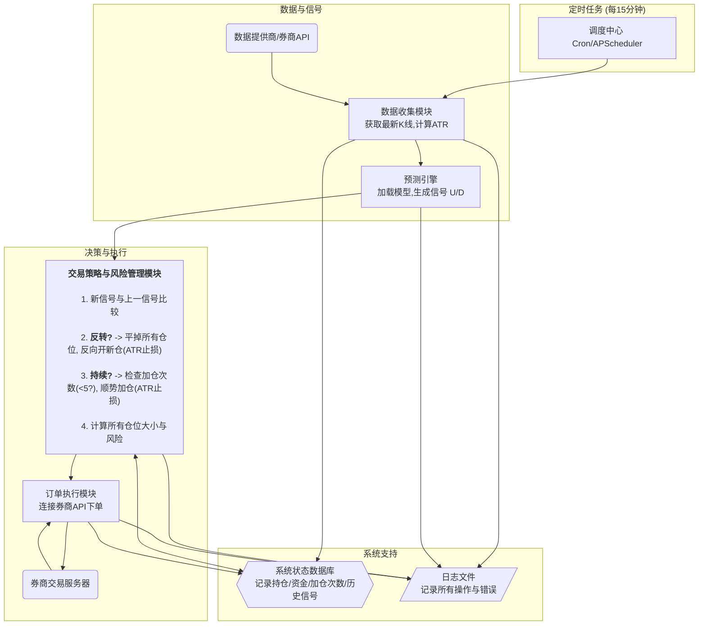

# Enhancing-Market-Trend-Prediction-Using-Convolutional-Neural-Networks-

**此项目基于Enhancing-Market-Trend-Prediction-Using-Convolutional-Neural-Networks-开发**

## 项目分析

这个项目旨在利用卷积神经网络（CNN）通过分析金融市场图表（特别是EUR/USD货币对的15分钟K线图）来辅助交易决策。其核心思想是将K线图转换为图像，然后训练一个图像分类模型来识别当前的趋势状态（上升或下降）。

### 工作流程

1.  **数据预处理与特征工程**:
    *   项目首先加载 `EURUSD_M15.csv` 中的历史价格数据。
    *   使用 `talib` 库计算20周期的简单移动平均线（SMA），这是一个关键的技术指标。
    *   脚本 `Pattern_Technical indicators _Next Close price.py` 会遍历数据，但它并**不预测未来**。相反，它基于一个**当前的规则**来创建标签：
        *   它使用一个滑动窗口（大小为5，步长为2）来扫描数据。
        *   只有当窗口内的最后一个时间点**出现了 `talib` 库中定义的任意一种K线形态**时，它才会继续处理。
        *   如果出现了K线形态，它会检查当前收盘价 `Close` 与 `SMA` 的关系：
            *   如果 `Close > SMA`，则将这个窗口的K线图标记为 **`uptrend`** （上升趋势）。
            *   如果 `Close < SMA`，则标记为 **`downtrend`** （下降趋势）。
    *   符合条件的K线图窗口（包含价格、成交量和SMA线）被渲染成图像，并保存到 `uptrend` 和 `downtrend` 文件夹中。

2.  **模型训练**:
    *   脚本 `CNN.py` 负责模型的训练。
    *   它将上一步生成的图像文件夹分割为训练集、验证集和测试集。
    *   它定义了一个标准的CNN架构，包含三个卷积层和池化层，用于从图像中提取视觉特征。
    *   模型被训练来对输入的K线图图像进行二元分类（`uptrend` 或 `downtrend`）。
    *   训练完成后，模型被保存为 `chart_classification_model.h5`。

3.  **交易模拟与回测**:
    *   脚本 `simulation.py` 展示了如何应用训练好的模型进行交易。
    *   它在一段**测试数据**上重复图像生成的过程，但不进行标记。
    *   然后，它加载训练好的CNN模型，对这些新生成的图像进行预测，得到一系列 `U` (Up) 和 `D` (Down) 的信号。
    *   一个关键的策略是：它会**过滤掉连续的相同信号**。只有当信号发生**改变**时（例如，从 `D` 变为 `U`），才认为是一个交易机会。
    *   **交易逻辑**:
        *   当信号从 `D` 变为 `U` 时，执行"买入"操作。
        *   当信号从 `U` 变为 `D` 时，执行"卖出"操作。
    *   最后，它计算并打印出在测试数据上的模拟交易结果，并在一张图表上可视化买卖点。

### 项目的用途与核心观点

*   **用途**: 此项目提供了一个将图表形态视觉识别与机器学习相结合的量化交易策略框架。它可以被用来：
    *   自动识别符合特定技术指标（价格与SMA关系）的K线形态。
    *   基于模型的分类结果，在模拟环境中回测一个动量反转策略。
    *   为对量化交易和深度学习感兴趣的开发者提供一个学习和实验的起点。

*   **核心观点**:
    *   **这不是一个预测模型**: 它并不预测未来的价格会上涨还是下跌。它是一个**模式识别与分类模型**。它学习识别"当前看起来像上升趋势的图表"和"当前看起来像下降趋势的表"。其盈利的假设在于：当趋势状态发生改变时（例如，模型分类结果从D变为U），新的趋势会持续一段时间，从而产生利润。
    *   **性能依赖于标签策略**: 整个系统的有效性高度依赖于其标签策略（即 `Close > SMA` 为上升）。如果这个基本规则本身不是一个有效的盈利策略，那么模型最终也只是在高效地执行一个无效的策略。
    *   **K线形态作为过滤器**: 将 `talib` 中的K线形态作为生成训练样本的"触发器"是一个巧妙的设计。它使得模型不必分析每一个时间点，而是只关注那些可能包含更多信息、被认为是市场转折点的K线形态。

### 如何使用

#### 1. 环境设置

首先，建议创建一个独立的Python虚拟环境。这里我们使用 `uv`。

```bash
# 如果你没有 uv，先安装它
pip install uv
# 创建一个名为 .venv 的虚拟环境
uv venv
# 激活环境
source .venv/bin/activate
```

然后安装所需的依赖包：

```bash
# 使用 uv 安装，速度更快
uv pip install numpy pandas matplotlib scikit-learn tensorflow pillow mplfinance split-folders gdown talib-binary
```
**注意**: `TA-Lib` 的安装可能比较复杂。`talib-binary` 为大多数系统提供了预编译的二进制包，可以简化安装。如果失败，请参考官方TA-Lib文档进行安装。

#### 2. 下载预训练模型

你可以跳过数据生成和训练步骤，直接使用作者提供的预训练模型。

```bash
# gdown 已经通过上面的命令安装
python download_model.py
```
这将会下载 `chart_classification_model.h5` 文件。

#### 3. 生成数据并训练新模型（可选）

如果你想从头开始，可以按以下步骤操作：

1.  **准备数据**: 确保 `EURUSD_M15.csv` 文件在项目根目录。
2.  **生成图表图像**: 运行脚本来生成用于训练的图片。
    ```bash
    python "Pattern_Technical indicators _Next Close price.py"
    ```
    执行后，你会在 `chart_images5_1` 目录下看到 `uptrend` 和 `downtrend` 两个文件夹，里面装满了 `.png` 图像。
3.  **训练CNN模型**: 运行CNN训练脚本。
    ```bash
    python CNN.py
    ```
    这个过程会花费一些时间，具体取决于你的硬件。训练完成后，会生成一个新的 `chart_classification_model.h5` 模型文件，并显示模型的性能评估图表。

#### 4. 运行交易模拟

这是项目的最终应用步骤。该脚本会使用模型在一段测试数据上进行模拟交易，并输出结果。

```bash
python simulation.py
```

执行后，终端会打印出一系列的买入和卖出操作记录，以及最终的资金情况。同时，会弹出一个图表窗口，在K线图上用 `U` 和 `D` 标记出模型产生信号的位置。

---

